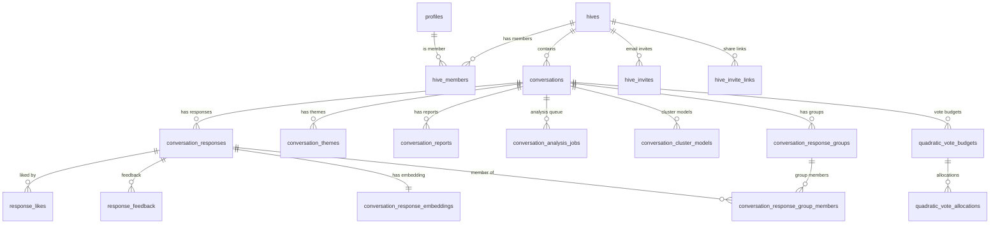

``# Database Schema (Supabase Postgres)

This folder is the single, centralized place to understand the backend database schema (tables, relationships, and important constraints/RLS).

## Sources of Truth

- Canonical snapshot: `docs/database/schema.sql` (generated from a real database)
- Incremental changes: `supabase/migrations/*.sql` (additive tables/columns, RLS policies, functions)

Note: this repo may not include _every_ historical migration that created the initial base tables. When in doubt, treat `docs/database/schema.sql` as the authoritative “what exists right now” snapshot.

## Regenerating `schema.sql`

This writes `docs/database/schema.sql` using `pg_dump` against a Postgres connection string.

1. Get a Postgres connection string (Supabase Dashboard → Database → Connection string).
2. Run:

```bash
export DATABASE_URL="postgresql://..."
npm run db:schema:snapshot
```

Optional flags:

- `--db-url "<postgres-url>"` (overrides env)
- `--out docs/database/schema.sql` (custom output path)
- `--schema public` (defaults to `public`)

## High-Level ERD (Guide)

This ERD is intentionally high-level (it omits many columns). Use it for orientation, then consult `schema.sql` for exact DDL.



## Table Map (What to Look For)

Core identity + membership:

- `profiles`: per-user profile fields (display name, avatar path, etc.)
- `hives`: a workspace/container
- `hive_members`: join table (`hive_id`, `user_id`, role)
- `hive_invites`, `hive_invite_links`: invite flows

Conversations:

- `conversations`: belongs to a hive (`hive_id`), has type/status fields
- `conversation_responses`: responses within a conversation (note: some features assume `id` is a `BIGINT`)
- `conversation_themes`: analysis output (themes/clusters)
- `conversation_reports`: generated reports / summaries

Voting + feedback:

- `response_likes`: lightweight preference signal per response
- `response_feedback`: richer feedback signals (used in analysis/reporting)
- `quadratic_vote_budgets`, `quadratic_vote_allocations`: vote budgeting + allocations (per user/conversation)

Async analysis + derived data:

- `conversation_analysis_jobs`: job queue (`status`, `strategy`, `locked_at`, `attempts`, `last_error`)
- `conversation_cluster_models`: persisted centroids/stats for incremental clustering
- `conversation_response_embeddings`: embedding vectors (per response) for similarity grouping
- `conversation_response_groups`: “frequently mentioned” groups (near-duplicate clusters within themes)
- `conversation_response_group_members`: join table linking responses to groups

## RLS + Roles (Important)

Most tables are protected by Row Level Security (RLS). Patterns to expect:

- “Users can view … for conversations in their hives” via `hive_members` + `auth.uid()`
- Writes for derived/analysis tables are typically restricted to the server/service role
- Worker job claiming may use SQL functions (e.g. `claim_analysis_job`, `fetch_next_analysis_job`) to avoid PostgREST schema cache issues
